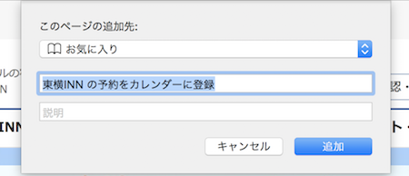

# Bookmarklet.ToyokoInnToCalendar

東横INN の予約内容詳細ページの情報から iCalender 形式のファイルを生成するブックマークレットです。予約した東横INN の予定をカレンダーに登録したいときに便利です。


## 動作環境

- macOS High Sierra 10.13.1
- Safari 11.0.1


## インストール方法

### Safari (macOS)

手作業で登録する方法 (B) は手間が多かったので、簡単に登録できるスクリプトを使う方法 (B) を用意しました。
macOS でブラウザー Safari を使っている人は使ってください。

#### A. セットアップ・スクリプトを使う方法 (macOS + Safari)

Terminal で、このリポジトリーをクローンしたディレクトリーに移動して、次のコマンドを実行します。

```sh
sh Setup/Safari.sh
```

これで Safari のブックマークに `Bookmarklet` という名前のフォルダーが作成され、その中に `東横INN の予約をカレンダーに登録` という名前のブックマークが登録されます。

#### B. 手作業で登録する場合

まずは **どのページでもいい** ので、ブックマークに追加 (`⌘D`) します。

迷うようなら [東横INN のホームページ](https://www.toyoko-inn.com) をブックマーク登録します。このとき、ブックマーク名を `東横INN の予約をカレンダーに登録` など、ブックマークレットであることが分かりやすい名前に変えます。



ブックマークを登録したら、ブックマークを編集 (`⌥⌘B`) します。
そして次のコードコピーして、先ほど登録したブックマークの `アドレス` のところにペーストします。


```html
javascript:%28function%28%29%20%7B%0A%09const%20e%20%3D%20document.createElement%28%27script%27%29%3B%0A%09const%20url%20%3D%20%27https%3A//cdn.jsdelivr.net/gh/es-kumagai/Bookmarklet.ToyokoInnToCalendar@develop/ToyokoInnToCalendar.js%27%3B%0A%09e.charset%3D%27utf-8%27%3B%0A%09e.src%3Durl%3B%0A%09document.body.appendChild%28e%29%3B%0A%7D%29%28%29
```


## 使い方

### A. 予約完了のページで使う

[東横INN の公式ホテル予約サイト画面](https://www.toyoko-inn.com) での予約が完了したら、その **ご宿泊予約完了** 画面が表示されている状態で、登録したブックマークレット `東横INN の予約をカレンダーに登録` を実行すると、その予約の iCalendar ファイルが生成されて、ダウンロードされます。

### B. 予約済みのページで使う

[東横INN の公式ホテル予約サイト画面](https://www.toyoko-inn.com) にアクセスして、マイページを表示したら **予約確認・変更・キャンセル** 画面に移動します。
そこから、カレンダーに登録したい予約の `ご予約詳細・変更` をクリックして、予約内容詳細のページに移動します。

このページ上で、登録したブックマークレット `東横INN の予約をカレンダーに登録` を実行すると、その予約の iCalendar ファイルが生成されて、ダウンロードされます。
 
> 未来の予約の詳細画面でだけ期待どおりに動作します。過去の宿泊、キャンセル済みの予約の詳細画面では動作しません。
